<!-- Banner principal -->

  

---

## 📣 Conéctate conmigo

Si quieres seguirme o ponerte en contacto, aquí tienes mis redes sociales:

---

### Lenguajes de Programación 

  
  
  
  
  
  
  
  
  
  
  
  

### Frameworks and Tools 

  
  
  
  
  
  
  
  
  
  
  
  
  
  

---

## 🔥 Listado de Proyectos

Aquí algunos de los listados de los projectos que tengo:

1. **[PROJECTOS DEL CILO DE DAW](https://github.com/DIEGUSPLAY12/MIS_PROJECTOS)**
   
   Ubicación con todos los trabajos del cilo de DAW ( HTML, Css, SQL)
   
3. **[PROJECTOS DEL CICLO DE DAW (solo Java)](https://github.com/DIEGUSPLAY12/ONLY_JAVA)**
   
   Ubicación con todos los trabajos del cilo de DAW ( solo de Java)
   
---

## 📊 Estadísticas de GitHub

---

## 📩 ¿Tienes alguna pregunta?

¡No dudes en ponerte en contacto! Siempre estoy dispuesto/a a colaborar en nuevos proyectos y aprender de los demás. Puedes enviarme un mensaje en cualquiera de mis redes sociales o a través de mi correo electronico que puedes enconttrar en mi bio debajo de mi foto de perfil.

---

