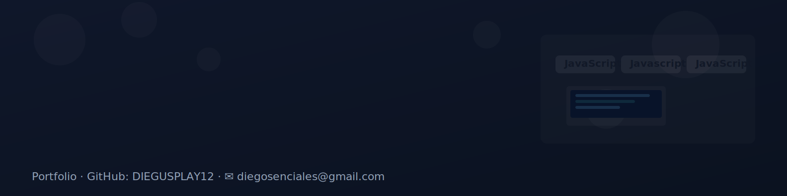

  

---

## 👤 Sobre mí  

> Soy estudiante de **Desarrollo de Aplicaciones Web**, enfocado en el **frontend**.  
> Me gusta crear proyectos que mezclen **diseño y funcionalidad**, y ahora mismo estoy aprendiendo **TypeScript** y algunos **frameworks modernos**.  
> 
> Tengo mucho interés en el **UI/UX** y en cómo mejorar el **rendimiento de las páginas web**, con la meta de seguir creciendo como desarrollador y aportar en proyectos reales. 

---

## 💻 Lenguajes de Programación  

  
  
  
  
  
  

 

## ⚙️ Frameworks y Herramientas  

  
  
  
  
  
  

---

## 🚀 Proyectos a poder observar  

Aquí encontrarás algunos de mis proyectos más relevantes desarrollados durante el ciclo de **DAW**:  

| 🌐 HTML y CSS | ☕ Java | 🐘 PHP |
| :--- | :--- | :--- |
| _Colección de trabajos y prácticas enfocados en HTML, CSS y SQL._ | _Ejercicios, prácticas y pequeños proyectos realizados con Java._ | _Ejercicios, prácticas y proyectos desarrollados en PHP._ |
| [**👉 Ver repositorio**](https://github.com/DIEGUSPLAY12/MIS_PROJECTOS) | [**👉 Ver repositorio**](https://github.com/DIEGUSPLAY12/ONLY_JAVA) | [**👉 Ver repositorio**](https://github.com/DIEGUSPLAY12/PHP_ME) |

---

<h2 align="center">📊 Estadísticas de GitHub</h2>  

  
  

  

---

<h2 align="center">📬 Contacto</h2>  

  Estoy abierto a colaborar en nuevos proyectos y aprender de otros desarrolladores.   
  Puedes encontrarme en las siguientes redes:  

  
  
  
  

 

  

