<!-- Banner principal -->

  

---

## Sobre mi  

**Estudiante de Desarrollo de Aplicaciones Web**, con enfoque en el **desarrollo frontend**.
Apasionado por crear proyectos que combinen **diseño y funcionalidad**, actualmente aprendiendo **TypeScript y frameworks modernos**.
Interesado en **UI/UX y en la optimización del rendimiento web**, con el objetivo de crecer como desarrollador y aportar valor en proyectos reales.

---

## Lenguajes de Programación  

  
  
  
  
  
  

---

## Frameworks y Herramientas  

  
  
  
  
  
  

---

## Proyectos Destacados  

Algunos de mis proyectos más relevantes durante el ciclo de DAW:  

- **[Proyectos del ciclo DAW](https://github.com/DIEGUSPLAY12/MIS_PROJECTOS)**  
  Trabajos en HTML, CSS y SQL.  

- **[Proyectos en Java](https://github.com/DIEGUSPLAY12/ONLY_JAVA)**  
  Ejercicios y prácticas en Java.  

---

## Estadísticas de GitHub  

  

  

  

---

## Contacto  

Estoy abierto a colaborar en nuevos proyectos y aprender de otros desarrolladores.  
Puedes encontrarme en las siguientes redes:  

  
  
  
  

  

